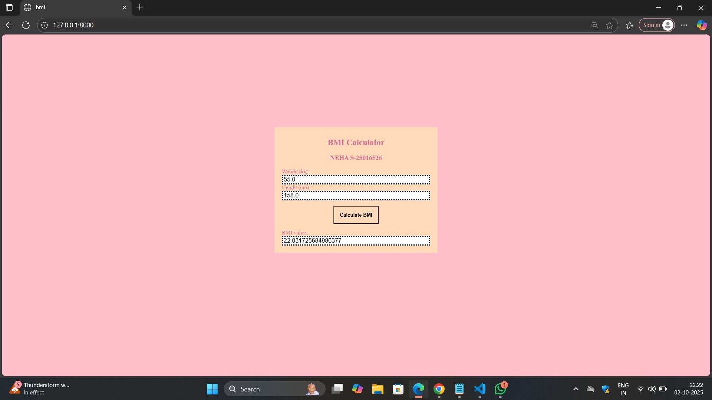

# Ex.05 Design a Website for Server Side Processing
## Date:02/10/2025

## AIM:
 To design a website to calculate the Body Mass Index (BMI) in the server side.


## FORMULA:
BMI = W/H<sup>2</sup>
<br> BMI --> Body Mass Index
<br> W --> Weight
<br> H --> Height

## DESIGN STEPS:

### Step 1:
Clone the repository from GitHub.

### Step 2:
Create Django Admin project.

### Step 3:
Create a New App under the Django Admin project.

### Step 4:
Create python programs for views and urls to perform server side processing.

### Step 5:
Create a HTML file to implement form based input and output.

### Step 6:
Publish the website in the given URL.

## PROGRAM :
```
bmi.html

<html>
    <head>
    <title>bmi</title>
    <style>
        body{
            background-color:pink;
        }
        .form{
            width: 400px;
            margin: 250px auto;
            background-color:peachpuff;
            color:palevioletred;
            padding: 10px 20px 20px 20px;
            font-size: 15px;
        }
        .form h2{
            color:palevioletred;
            text-align: center;
        }
        .form h3{
            color:palevioletred
            font-size:larger;
            text-align:center
        }
        .form label{
            display:flex
        }
        .input input{
            border: dotted; 
            margin:auto;
            font-size:medium;
            width: 100%;

        }
        .b{
            text-align: center;
            padding: auto;
            margin-top: 15px;
            margin-bottom: 15px;
        }
        button{
            padding: 15px;
            background-color:peachpuff;
        }
    </style>
    </head>
<body>
    <div class="form">
        <h2><b>BMI Calculator</b></h2>
        <h3>NEHA S-25016526</h3>
        <form method="post">
        
        <div class="input">
            <label for="Weight">Weight (kg):</label>
            <input type="number" name="weight" required value="{{weight}}">
        </div>
        <div class="input">
            <label for="Height">Height  (cm):</label>
            <input type="number" name="height" required value="{{height}}">
        </div>
        <div class="b">
            <button type="submit"><b>Calculate BMI</b></button>
        </div>
        </form>
        
        <div class="input">
            <label for="bmi">BMI value: </label>
            <input type="text" required value="{{bmi}}">
        </div>
        
    </div>
</body>
</html>

views.py

from django.shortcuts import render
def calculate_bmi(request):
    bmi=None
    catagory=None
    height=None
    weight=None
    if request.method=="POST":
        height=float(request.POST.get("height"))
        weight=float(request.POST.get("weight"))
        bmi=weight/((height/100)**2)
        print(f"Weight: {weight}kg \nHeight: {height}cm \nBMI: {bmi}")
    return render(request, "mathapp/bmi.html",{"bmi": bmi, "height": height, "weight": weight})

urls.py

from django.contrib import admin
from django.urls import path
from mathapp import views

urlpatterns=[
    path('admin/', admin.site.urls),
    path('',views.calculate_bmi,name='calculate_bmi'),
]
```


## SERVER SIDE PROCESSING:


## HOMEPAGE:


## RESULT:
The program for performing server side processing is completed successfully.
